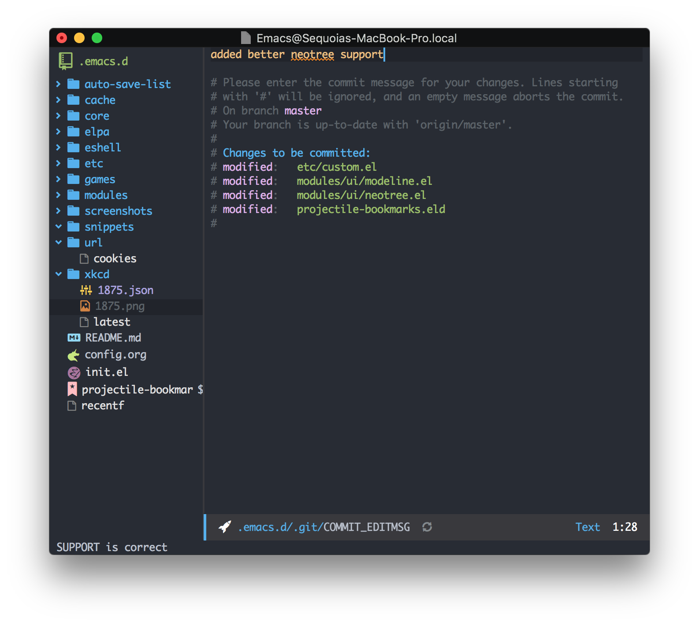

# Sequoia Snow's Emacs Configuration

This is the emacs configuration used by me personally, so don't feel obligated
to use it as well. That being said, Emacs rules Vim drools and you should definitely
try out Emacs.

## Notable Features

* Vim keybindings with evil mode
* Great haskell/stack support
* Latex editing in org mode
* Custom modeline with a rocket in it
* Tons of other stuff to discover on your own!

To use this config just clone the emacs repo over to your .emacs and use emacs `v25+`.
Also be sure to install all the icons fonts.

```
M-x all-the-icons-install-fonts
```





> It was Tolkien who said "not all those who wander are lost". I'm afraid that if you've
> stumbled upon this repository, the statement may not apply to you...
