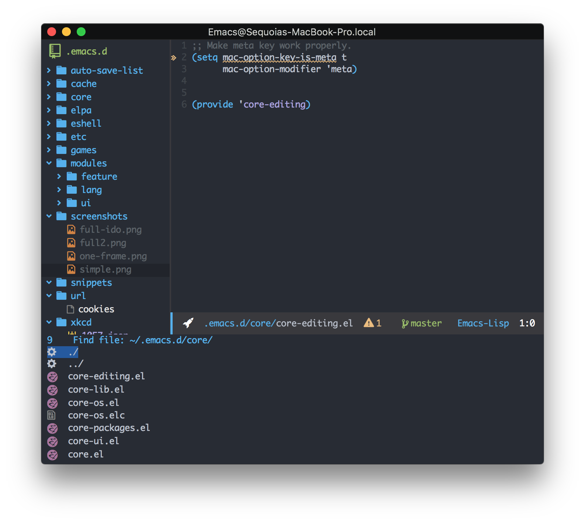
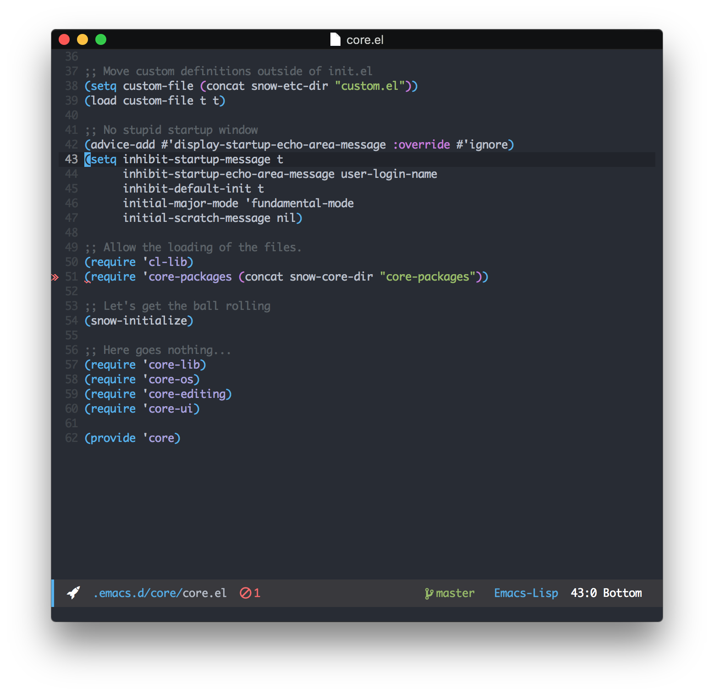

# Sequoia Snow's Emacs Configuration

This is a **very simple** emacs configuration used by me personally,
don't feel obligated to use it as well. However, it works for me, and,
if it can help you, so much the better.

Just clone the emacs repo over to your .emacs and use emacs `v25+`

```
M-x all-the-icons-install-fonts
```

Also, if you have difficulties, open and close emacs a few times.



